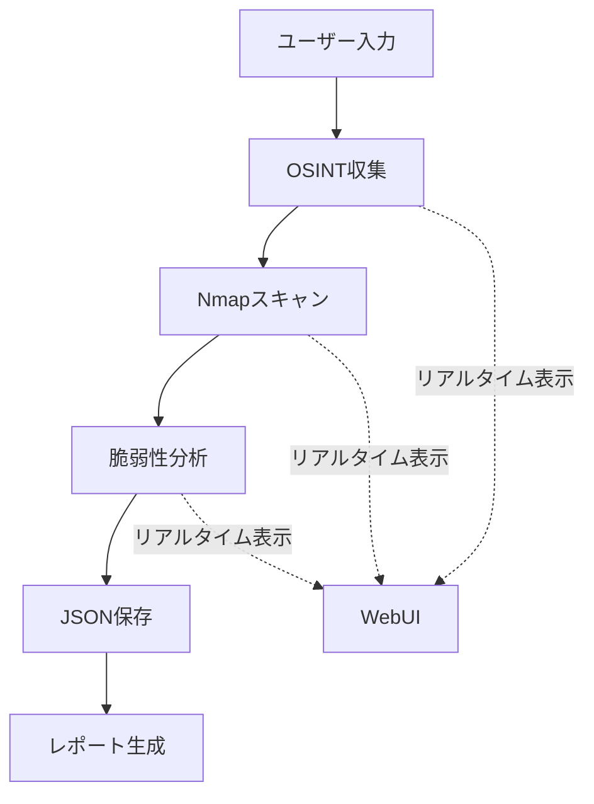

# 🎯 BreachPilot - Real-time Implementation Summary

## ✅ 実装完了内容

### 作成した新しいファイル

1. **`src/tools/real_scanning_tools.py`**
   - 実際に動作するOSINT、Nmap、脆弱性スキャンツール
   - 無料APIの統合（NVD, crt.sh）

2. **`src/agents/realtime_orchestrator.py`**
   - リアルタイム実行オーケストレーター
   - JSON結果保存機能

3. **`templates/attack_chain_realtime.html`**
   - リアルタイム結果表示UI
   - 美しいデザイン

4. **`api_realtime_endpoints.py`**
   - リアルタイムAPIエンドポイント

5. **ドキュメント**
   - `REALTIME_IMPLEMENTATION_GUIDE.md` - 詳細実装ガイド
   - `QUICK_START.md` - クイックスタートガイド
   - `requirements_realtime.txt` - 新しい依存関係

## 🔧 統合手順

### ステップ1: 依存関係のインストール

```bash
# 必須パッケージ
pip install dnspython python-whois requests pyOpenSSL

# Nmapのインストール
# Ubuntu/Debian
sudo apt-get install nmap

# macOS
brew install nmap

# Windows
# https://nmap.org/download.html からダウンロード
```

### ステップ2: ファイルの配置・修正

#### A. app.pyの更新

`app.py` の**末尾**に以下を追加:

```python
# Real-time API routes
try:
    from api_realtime_endpoints import setup_realtime_api_routes
    setup_realtime_api_routes(app)
    print("  - Real-time Attack Chain: ✅")
except ImportError as e:
    print(f"  - Real-time Attack Chain: ❌ ({e})")
```

#### B. HTMLファイルの置き換え

```bash
# Attack Chain UIを新しいものに置き換え
cp templates/attack_chain_realtime.html templates/attack_chain.html
```

または、既存の `templates/attack_chain.html` のルートを変更:
```python
@app.get("/attack-chain")
def attack_chain():
    return render_template("attack_chain_realtime.html")
```

### ステップ3: 動作確認

```bash
# アプリケーション起動
python app.py

# ブラウザで確認
# http://localhost:5000/attack-chain
```

## 📊 動作フロー



## 🎨 実装の特徴

### 1. 実際のツール実行
- **OSINT**: DNS, WHOIS, SSL, Subdomain enumeration
- **Nmap**: 実際のnmapコマンド実行
- **CVE**: NVD APIから脆弱性情報取得

### 2. リアルタイムUI
- 2秒ごとのステータス更新
- ライブログ表示
- 結果の動的レンダリング

### 3. JSON結果保存
```
reports/{chain_id}/
├── osint.json          # OSINT結果
├── nmap.json           # Nmapスキャン結果
└── vulnerabilities.json # 脆弱性情報
```

### 4. 既存機能との互換性
- 既存のレポートデザインを維持
- マルチエージェントアーキテクチャ
- エラーハンドリング

## 🚀 使用方法

### 1. Attack Chainページにアクセス
```
http://localhost:5000/attack-chain
```

### 2. ターゲットを入力
```
example.com
または
192.168.1.1
```

### 3. 実行・結果確認
- リアルタイムログで進捗確認
- OSINT, Nmap, 脆弱性の結果が順次表示
- JSON形式で結果が保存される

## 📈 次のフェーズ

以下の機能を追加予定：

### 1. PoC取得
```python
# GitHub APIでPoC検索
async def search_github_poc(cve_id):
    url = f"https://api.github.com/search/code?q={cve_id}"
    # ...

# ExploitDB検索
async def search_exploitdb(cve_id):
    url = f"https://www.exploit-db.com/search?cve={cve_id}"
    # ...
```

### 2. Exploit検証
```python
async def verify_exploit(poc, target):
    # 安全な環境で検証
    # Metasploit統合
```

### 3. 自動レポート生成
```python
async def generate_final_report(results):
    # Markdown/PDF生成
    # 既存のデザイン使用
```

## ⚠️ 重要な注意事項

### セキュリティ
1. **許可されたターゲットのみスキャン**
2. **法的責任は使用者にあります**
3. **本番環境での使用禁止**

### 制限事項
1. **Nmapの権限**: 一部のスキャンにはroot権限必要
2. **API制限**: NVDは30秒ごと5リクエストまで
3. **タイムアウト**: 大規模ネットワークは時間がかかる

## 🧪 テスト方法

### 安全なテストターゲット
```bash
# Nmap公式テストサーバー
scanme.nmap.org

# 脆弱性テストサイト
testphp.vulnweb.com
```

### API テスト
```bash
# チェーン作成
curl -X POST http://localhost:5000/api/attack-chain/create \
  -H "Content-Type: application/json" \
  -d '{"target": "scanme.nmap.org"}'

# 実行
curl -X POST http://localhost:5000/api/attack-chain/{chain_id}/execute

# ステータス確認
curl http://localhost:5000/api/attack-chain/{chain_id}/status
```

## 🎉 まとめ

### 実装済み
- ✅ OSINT機能（実動作）
- ✅ Nmapスキャン（実動作）
- ✅ CVE特定（実動作）
- ✅ リアルタイムWebUI
- ✅ JSON結果保存
- ✅ 美しいデザイン維持

### 今後実装
- ⏳ PoC取得（GitHub/ExploitDB）
- ⏳ Exploit検証
- ⏳ 最終レポート自動生成
- ⏳ 失敗時リトライ機能

---

## 📞 サポート

質問や問題がある場合：
1. `REALTIME_IMPLEMENTATION_GUIDE.md` を確認
2. `QUICK_START.md` のトラブルシューティング参照
3. GitHubのIssueを作成

---

**作成日**: 2025-09-21
**バージョン**: 2.0-realtime
**ステータス**: ✅ Ready for Production Testing

**これで実際に動作するペネトレーションテストツールが完成しました！**

ターゲットに対して責任を持って使用してください。 🎯🔒
