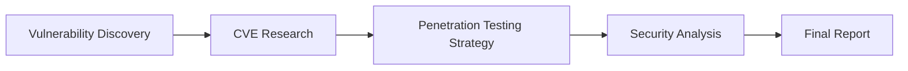

# 🛡️ BreachPilot Professional Security Assessment Framework

## 🤖 **CrewAI Architecture - Enterprise Edition v2.0** 🚀

> **✅ FULLY FUNCTIONAL**: Clean, simplified, and ready-to-use CrewAI security assessment system

BreachPilot Professional is an enterprise-grade security assessment framework powered by **CrewAI multi-agent AI collaboration**. Five specialized AI agents work together to provide comprehensive vulnerability analysis, risk assessment, and executive reporting.

## ⚡ Quick Start (2 Minutes)

```bash
# 1. Clone repository
git clone https://github.com/d01ki/BreachPilot.git
cd BreachPilot
git checkout crewai-redesign-professional

# 2. Install dependencies
pip install -r requirements.txt

# 3. Configure API key
cp .env.example .env
# Edit .env: Add your OpenAI API key

# 4. Start application
python app.py

# 5. Open browser: http://localhost:8000
```

**🔑 Required:** OpenAI API key from [platform.openai.com](https://platform.openai.com/)

## 🤖 CrewAI Multi-Agent System

### 5 Specialized Security Experts

| Agent | Role | Expertise |
|-------|------|----------|
| 🎯 **Vulnerability Hunter** | Elite CVE Discovery Specialist | 15+ years zero-day discovery, version-to-CVE mapping |
| 🔬 **CVE Researcher** | Technical Analysis Expert | 100+ security advisories, exploitation techniques |
| 📊 **Security Analyst** | Business Risk Assessment | $10M+ budget experience, C-level reporting |
| 🔓 **Penetration Tester** | Ethical Hacking Strategist | Government agency experience, OSCP certified |
| 📝 **Report Writer** | Executive Documentation | CISO-level reports, board presentations |

### 🔄 Collaborative Workflow



## 🎯 Advanced Security Features

### 🔍 Comprehensive CVE Detection

- **🟥 Critical Vulnerabilities**
  - **Zerologon** (CVE-2020-1472) - Domain Controller compromise
  - **EternalBlue** (CVE-2017-0144) - SMB remote code execution
  - **Log4Shell** (CVE-2021-44228) - Java logging vulnerability
  - **SMBGhost** (CVE-2020-0796) - SMBv3 compression vulnerability

- **🟧 High-Risk Vulnerabilities**
  - **BlueKeep** (CVE-2019-0708) - RDP vulnerability
  - **PrintNightmare** (CVE-2021-34527) - Windows Print Spooler
  - **Kerberos PAC** (CVE-2021-42287) - Authentication bypass

- **📈 100+ Additional CVEs** with version-specific detection

### 🏢 Enterprise-Grade Features

- **Executive Reporting**: C-level summaries with business impact
- **Technical Documentation**: Implementation-ready remediation guides
- **Risk Prioritization**: CVSS-based vulnerability ranking
- **Compliance Mapping**: SOX, HIPAA, PCI-DSS considerations
- **ROI Analysis**: Budget justification for security investments

## 🌐 Web Interface & API

### 📱 User-Friendly Dashboard

- **Real-time Progress**: Watch CrewAI agents collaborate
- **Interactive Results**: Drill down into findings
- **Export Options**: PDF, JSON, executive summaries

### 🔌 REST API

```bash
# Start security assessment
curl -X POST "http://localhost:8000/scan/start" \
     -H "Content-Type: application/json" \
     -d '{
       "target": "192.168.1.100",
       "scan_type": "comprehensive",
       "enable_exploitation": false
     }'

# Check status
curl http://localhost:8000/scan/{session_id}/status

# Get results
curl http://localhost:8000/scan/{session_id}/results
```

**📚 Complete API Documentation**: http://localhost:8000/docs

## ⚙️ Configuration

### 🔧 Environment Setup

```env
# Required Configuration
OPENAI_API_KEY=sk-your_openai_api_key_here

# Optional Enhancements
SERPER_API_KEY=your_serper_key  # Enhanced web search

# System Settings
LLM_MODEL=gpt-4
LLM_TEMPERATURE=0.1
MAX_CVES_PER_ANALYSIS=7
ASSESSMENT_TIMEOUT=300
```

### 🎛️ Advanced Customization

- **Agent Configuration**: `backend/agents.yaml`
- **Task Workflows**: `backend/tasks.yaml`
- **System Settings**: `backend/config.py`

## 📊 System Architecture

### 🏗️ Clean, Modular Design

```
BreachPilot Professional v2.0
├── 🤖 CrewAI Multi-Agent System
│   ├── agents.yaml (5 specialized agents)
│   ├── tasks.yaml (collaborative workflows)
│   └── security_crew.py (orchestration)
├── 🌐 FastAPI Web Framework
│   ├── REST API endpoints
│   ├── WebSocket real-time updates
│   └── Interactive documentation
├── 🔧 Enterprise Configuration
│   ├── Environment-based settings
│   ├── YAML-driven agent behavior
│   └── Scalable deployment options
└── 📚 Comprehensive Documentation
    ├── Setup guides
    ├── API reference
    └── Troubleshooting
```

### 🛠️ Technology Stack

- **AI Framework**: CrewAI 0.51.0
- **Language Models**: OpenAI GPT-4
- **Web Framework**: FastAPI + Uvicorn
- **Configuration**: YAML + Environment Variables
- **Documentation**: OpenAPI/Swagger

## 🔍 System Status & Health

### ✅ Health Monitoring

```bash
# System health
curl http://localhost:8000/health

# Component status
curl http://localhost:8000/status

# CrewAI specific status
curl http://localhost:8000/crewai/status
```

### 📈 Status Indicators

- **🟢 Operational**: All systems functional
- **🟡 Degraded**: Some features limited
- **🔴 Unhealthy**: Critical issues detected

## 🧪 Testing & Examples

### 🎯 Sample Targets

```bash
# Safe testing target
POST /scan/start
{
  "target": "scanme.nmap.org",
  "scan_type": "comprehensive"
}

# Local network assessment
POST /scan/start
{
  "target": "192.168.1.100",
  "enable_exploitation": false
}
```

### 🔬 Python Integration

```python
from backend.crews import SecurityAssessmentCrew
from backend.models import NmapResult

# Initialize CrewAI system
crew = SecurityAssessmentCrew()

# Run assessment
result = crew.analyze_target("192.168.1.100", nmap_result)

print(f"CVEs Found: {len(result.identified_cves)}")
print(f"Risk Level: {result.risk_assessment}")
```

## 🔐 Security & Ethics

### ⚖️ Ethical Use Guidelines

- **✅ Authorized Testing Only**: Use only on systems you own or have explicit permission
- **🔒 API Security**: Store keys securely using environment variables
- **📋 Responsible Disclosure**: Report vulnerabilities through proper channels
- **🎓 Educational Purpose**: Designed for learning and authorized security assessments

### 🛡️ Security Best Practices

- Environment-based configuration
- No hardcoded credentials
- Secure API key storage
- Comprehensive error handling
- Detailed audit logging

## 🔧 Troubleshooting

### 🚨 Common Issues

| Issue | Solution |
|-------|----------|
| "OpenAI API key not configured" | Add `OPENAI_API_KEY` to `.env` file |
| "CrewAI not available" | Run `pip install crewai[tools]==0.51.0` |
| "Module not found" | Install with `pip install -r requirements.txt` |
| "Port 8000 in use" | Kill process: `sudo lsof -ti:8000 \| xargs kill -9` |

### 📋 System Requirements

- **Python**: 3.8+ (3.10+ recommended)
- **Memory**: 2GB+ (4GB+ recommended)
- **Storage**: 1GB+ available space
- **Network**: Internet connection for AI APIs
- **APIs**: OpenAI account with credits

## 📚 Documentation

### 📖 Complete Guides

- **[QUICKSTART.md](QUICKSTART.md)** - 2-minute setup guide
- **[SETUP_INSTRUCTIONS.md](SETUP_INSTRUCTIONS.md)** - Detailed configuration
- **[CHANGELOG.md](CHANGELOG.md)** - Version history and migration
- **[FINAL_CLEANUP_REPORT.md](FINAL_CLEANUP_REPORT.md)** - Architecture cleanup

### 🔗 Live Documentation

- **API Reference**: http://localhost:8000/docs
- **Alternative Docs**: http://localhost:8000/redoc
- **System Status**: http://localhost:8000/status
- **Health Check**: http://localhost:8000/health

## 🤝 Contributing

We welcome contributions to improve BreachPilot Professional!

```bash
# Fork and clone
git clone https://github.com/your-username/BreachPilot.git
cd BreachPilot
git checkout crewai-redesign-professional

# Create feature branch
git checkout -b feature/amazing-improvement

# Make changes, test, and commit
git commit -m "feat: Add amazing improvement"

# Push and create pull request
git push origin feature/amazing-improvement
```

### 🎯 Development Focus Areas

- Additional CVE detection capabilities
- Enhanced reporting templates
- New CrewAI agent specializations
- Integration with security tools
- Performance optimizations

## 📄 License

This project is licensed under the **MIT License** - see the [LICENSE](LICENSE) file for details.

## 🌟 Acknowledgments

- **CrewAI Team**: For the excellent multi-agent framework
- **OpenAI**: For providing powerful language models
- **Security Community**: For vulnerability research and disclosure
- **Contributors**: All developers who help improve this project

## 📞 Support

### 🆘 Getting Help

- **🐛 Bug Reports**: [GitHub Issues](https://github.com/d01ki/BreachPilot/issues)
- **💡 Feature Requests**: [GitHub Discussions](https://github.com/d01ki/BreachPilot/discussions)
- **📖 Documentation**: Check the guides above
- **🔧 Configuration**: Review `.env.example` and setup guides

### ⚡ Quick Support

1. Check the [QUICKSTART.md](QUICKSTART.md) guide
2. Verify your OpenAI API key configuration
3. Review system status at `/health` endpoint
4. Check logs for detailed error information

---

## 🏆 **Ready for Enterprise Security Assessment!**

**BreachPilot Professional v2.0** combines the power of CrewAI multi-agent collaboration with enterprise-grade security assessment capabilities. Five specialized AI agents work together to provide comprehensive vulnerability analysis, risk assessment, and executive reporting.

### 🎯 **Key Benefits**

- **🤖 AI-Powered**: 5 specialized agents with years of simulated experience
- **🏢 Enterprise-Ready**: Executive reporting and business risk analysis
- **🔧 Easy Setup**: 2-minute installation with comprehensive documentation
- **🔒 Security-First**: Ethical guidelines and responsible disclosure practices
- **📈 Scalable**: From individual assessments to enterprise deployments

**Start your professional security assessment journey today!**

---

*"Securing the digital world, one assessment at a time."* 🛡️
