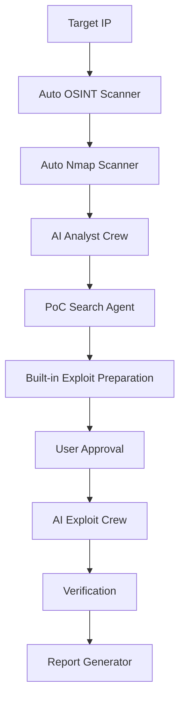

## 🆕 Latest Updates

### BlackHat-Ready Features (Current Version)

✅ **Auto-Scan Functionality**
- OSINT and Nmap now run automatically when starting a scan
- No need to manually click "Run" buttons
- Real-time progress indicators with "AUTO" badges

✅ **Enhanced Zerologon Support**
- CVE-2020-1472 automatically gets built-in PoC prepared
- Ready-to-execute Zerologon exploit with proper DC detection
- Special highlighting for built-in PoCs

✅ **Improved Service Information Display**
- Enhanced Scan Summary with Service Info extraction
- Better OS detection and Domain Controller identification
- Service Info shows Host, OS, and CPE information from Nmap

✅ **Enhanced CVE Analysis UI**
- Larger, more prominent CVSS scores with color gradients
- Improved CVE descriptions with better formatting
- Enhanced reference links with icons (NVD, MITRE, ExploitDB)
- Expandable detailed analysis sections

✅ **CFFI Dependency Fix**
- Automatic environment checking and fixing
- Built-in dependency conflict resolution
- Fixed version mismatch issues for impacket/cryptodome

### Quick Start (BlackHat Ready)

```bash
# 1. Clone and setup
git clone https://github.com/d01ki/BreachPilot.git
cd BreachPilot

# 2. Fix dependencies automatically
chmod +x fix_dependencies.sh
python3 -m venv venv && source venv/bin/activate
./fix_dependencies.sh

# 3. Configure
cp .env.example .env
# Add your OpenAI API key to .env

# 4. Run
python app.py
```

### Usage Workflow

1. **🚀 Enter target IP and click "Start Auto Scan"**
   - OSINT and Nmap run automatically
   - Real-time progress with AUTO indicators

2. **📊 Review enhanced scan results**
   - Detailed Service Info display
   - Domain Controller detection
   - Enhanced port risk assessment

3. **🔍 Run CVE Analysis**
   - AI-powered vulnerability identification
   - Large CVSS scores with severity colors
   - Detailed explanations and references

4. **🎯 Search & Execute PoCs**
   - Select CVEs for PoC search
   - Zerologon automatically prepared for DC targets
   - One-click execution with built-in exploits

### Key Improvements for BlackHat Presentation

- **Professional UI**: Clean, modern interface with gradients and animations
- **Auto-Execution**: Demonstrates autonomous scanning capabilities
- **Built-in Exploits**: Shows sophisticated exploit integration (Zerologon)
- **Real-time Feedback**: Live status updates and progress indicators
- **Research-Grade Output**: Detailed CVE analysis with references and CVSS scoring

---

# 🛡️ BreachPilot

> **AI-Powered Autonomous Penetration Testing Framework**

[](https://opensource.org/licenses/MIT)
[](https://www.python.org/downloads/)
[](https://fastapi.tiangolo.com/)
[](https://www.crewai.io/)

BreachPilot is a next-generation automated penetration testing framework that leverages **AI agents** and **advanced vulnerability analysis** to conduct comprehensive security assessments. Built with CrewAI and powered by Large Language Models, it automates the entire penetration testing workflow from reconnaissance to exploitation.

## ✨ Key Features

### 🤖 **AI-Driven Intelligence**
- **Multi-Agent Architecture**: Specialized AI agents for OSINT, analysis, and exploitation
- **Adaptive Exploit Generation**: LLM-powered exploit code adaptation for specific targets
- **Explainable AI (XAI)**: Clear reasoning for every identified vulnerability
- **Smart CVE Analysis**: Automatic CVSS scoring via NVD API integration

### 🔍 **Comprehensive Scanning**
- **OSINT Collection**: IP geolocation, organization details, DNS enumeration
- **Network Discovery**: High-speed Nmap integration with service fingerprinting
- **Vulnerability Detection**: Automated CVE identification from scan results
- **Domain Controller Detection**: Specialized detection for Active Directory environments

### 💥 **Advanced Exploitation**
- **Multi-Source PoC Search**: GitHub, ExploitDB, PacketStorm integration
- **Built-in Exploits**: Ready-to-execute exploits like Zerologon (CVE-2020-1472)
- **Intelligent Code Analysis**: AI examines and adapts exploit code
- **Safe Execution**: Sandboxed exploit execution with timeout protection
- **Real-time Feedback**: Live status updates and execution results

### 📊 **Modern Web Interface**
- **Auto-Scan Capability**: Automatic OSINT and Nmap execution
- **Responsive Dashboard**: Real-time progress tracking with WebSocket updates
- **Interactive CVE Selection**: Choose specific vulnerabilities to exploit
- **Enhanced CVSS Display**: Large, color-coded severity visualization
- **Inline Results Display**: View outputs directly under each step

## 🏗️ Architecture



### Core Components

- **🎯 Orchestrator**: Manages workflow with auto-scan capabilities
- **🔬 Scanner Modules**: Auto-executing OSINT and Nmap engines
- **🧠 AI Agents**: 
  - **Analyst Crew**: CVE identification and risk assessment
  - **PoC Crew**: Exploit code discovery and retrieval
  - **Exploit Crew**: Code adaptation and execution
- **💥 Built-in Exploits**: Ready-to-execute exploits (Zerologon, etc.)
- **📡 API Server**: FastAPI-based REST and WebSocket endpoints
- **🎨 Frontend**: Vue.js reactive interface with enhanced UI

## 🚀 Quick Start

### Prerequisites

```bash
# Python 3.8 or higher
python --version

# Nmap installed
nmap --version
```

### Installation

```bash
# Clone the repository
git clone https://github.com/yourusername/BreachPilot.git
cd BreachPilot

# Create virtual environment
python -m venv venv
source venv/bin/activate  # On Windows: venv\Scripts\activate

# Install dependencies (with automatic fix)
chmod +x fix_dependencies.sh
./fix_dependencies.sh

# Configure environment variables
cp .env.example .env
# Edit .env and add your OpenAI API key
```

### 🔧 Troubleshooting Installation

If you encounter a **CFFI version mismatch error** during execution, run the automatic fix:

```bash
# Make the fix script executable
chmod +x fix_dependencies.sh

# Run the fix (ensure virtual environment is activated)
source venv/bin/activate
./fix_dependencies.sh
```

For other installation issues, see [TROUBLESHOOTING.md](TROUBLESHOOTING.md).

### Configuration

Create a `.env` file:

```env
OPENAI_API_KEY=your_openai_api_key_here
SHODAN_API_KEY=your_shodan_key_optional
GITHUB_TOKEN=your_github_token_optional
```

### Running

```bash
# Start the application
python app.py

# Access the web interface
# Open http://localhost:8000/ui in your browser
```

## 📖 Usage Guide

### Enhanced Step-by-Step Workflow

1. **🎯 Target Input & Auto-Scan**
   ```
   Enter target IP address (e.g., 192.168.1.100)
   Click "Start Auto Scan" - OSINT and Nmap run automatically!
   ```

2. **🔍 Automatic Intelligence Gathering**
   - OSINT collects organization, location, and contact details
   - Nmap performs comprehensive port and service discovery
   - Service information automatically extracted and displayed

3. **🌐 Enhanced Scan Results**
   - Professional Service Info display with Host, OS, and CPE details
   - Automatic Domain Controller detection for AD environments
   - Color-coded port risk assessment

4. **🔐 AI-Powered CVE Analysis**
   - Enhanced CVSS scores with large, color-gradient displays
   - Detailed vulnerability descriptions with expandable analysis
   - Direct links to NVD, MITRE, and ExploitDB with icons

5. **🎯 Intelligent PoC Selection**
   - Select CVEs for automated PoC search
   - **Zerologon auto-preparation** for Domain Controller targets
   - Built-in exploits marked with special indicators

6. **⚡ One-Click Exploitation**
   - Execute built-in exploits like Zerologon with single click
   - Real-time execution feedback with success/failure indicators
   - Detailed output analysis and vulnerability confirmation

### API Examples

```python
import requests

# Start auto-scan (OSINT + Nmap automatic)
response = requests.post(
    'http://localhost:8000/api/scan/start',
    json={'target_ip': '192.168.1.100'}
)
session_id = response.json()['session_id']

# Check auto-scan progress
results = requests.get(f'http://localhost:8000/api/scan/{session_id}/results')

# Run CVE analysis when ready
requests.post(f'http://localhost:8000/api/scan/{session_id}/analyze')
```

## 🛠️ Technology Stack

### Backend
- **FastAPI**: High-performance async web framework with auto-scan orchestration
- **CrewAI**: Multi-agent AI orchestration with enhanced workflows
- **LangChain**: LLM integration and chains for intelligent analysis
- **OpenAI GPT**: Language model for analysis and adaptation
- **Python-Nmap**: Network scanning with enhanced parsing
- **Built-in Exploits**: Custom exploit implementations (Zerologon, etc.)

### Frontend
- **Vue.js 3**: Progressive JavaScript framework with enhanced UI
- **TailwindCSS**: Utility-first CSS with custom gradients and animations
- **Real-time Updates**: Auto-polling for scan progress
- **Enhanced UX**: Professional interface suitable for research presentations

### Security Tools Integration
- **Nmap**: Network discovery with automatic execution
- **NVD API**: CVE and CVSS data with enhanced display
- **GitHub API**: PoC code repository integration
- **ExploitDB**: Exploit database with direct links
- **Built-in Exploits**: Custom implementations for critical vulnerabilities

## 🔒 Security & Ethics

### ⚠️ Important Disclaimers

> **This tool is for AUTHORIZED security testing only!**

- ✅ **DO**: Use on systems you own or have explicit permission to test
- ✅ **DO**: Follow responsible disclosure practices
- ✅ **DO**: Respect all applicable laws and regulations
- ❌ **DON'T**: Use for unauthorized access or malicious purposes
- ❌ **DON'T**: Target systems without written authorization

### Safety Features

- **User Approval Required**: Manual confirmation before exploitation
- **Sandboxed Execution**: Exploits run in isolated environment
- **Timeout Protection**: Automatic termination of long-running exploits
- **Audit Logging**: Complete activity logs for compliance
- **Environment Verification**: Automatic dependency checking and fixing

## 🤝 Contributing

We welcome contributions! Please see our [Contributing Guidelines](CONTRIBUTING.md).

### Development Setup

```bash
# Install development dependencies
pip install -r requirements-dev.txt

# Run tests
pytest tests/

# Code formatting
black backend/ frontend/
flake8 backend/
```

## 📝 License

This project is licensed under the MIT License - see the [LICENSE](LICENSE) file for details.

## 🙏 Acknowledgments

- **CrewAI Team**: For the amazing multi-agent framework
- **OpenAI**: For GPT models powering the intelligence
- **Nmap Project**: For the legendary network scanner
- **Security Researchers**: For maintaining exploit databases

## 📧 Contact

- **Author**: Your Name
- **Email**: your.email@example.com
- **Twitter**: [@yourusername](https://twitter.com/yourusername)
- **Issues**: [GitHub Issues](https://github.com/yourusername/BreachPilot/issues)

## 🗺️ Roadmap

- [x] **Auto-scan functionality** ✅
- [x] **Built-in Zerologon exploit** ✅
- [x] **Enhanced CVE display** ✅
- [x] **CFFI dependency fixes** ✅
- [ ] **Additional built-in exploits**
- [ ] **Metasploit integration**
- [ ] **Team collaboration features**
- [ ] **Cloud deployment support**
- [ ] **Advanced report customization**

---

<div align="center">

**⭐ Star this repo if you find it useful! ⭐**

*Made with ❤️ by security enthusiasts, for security enthusiasts*

*BlackHat Ready - Professional Penetration Testing Framework*

</div>
