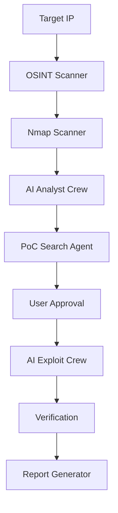

# 🛡️ BreachPilot

> **AI-Powered Autonomous Penetration Testing Framework**

[](https://opensource.org/licenses/MIT)
[](https://www.python.org/downloads/)
[](https://fastapi.tiangolo.com/)
[](https://www.crewai.io/)

BreachPilot is a next-generation automated penetration testing framework that leverages **AI agents** and **advanced vulnerability analysis** to conduct comprehensive security assessments. Built with CrewAI and powered by Large Language Models, it automates the entire penetration testing workflow from reconnaissance to exploitation.

## ✨ Key Features

### 🤖 **AI-Driven Intelligence**
- **Multi-Agent Architecture**: Specialized AI agents for OSINT, analysis, and exploitation
- **Adaptive Exploit Generation**: LLM-powered exploit code adaptation for specific targets
- **Explainable AI (XAI)**: Clear reasoning for every identified vulnerability
- **Smart CVE Analysis**: Automatic CVSS scoring via NVD API integration

### 🔍 **Comprehensive Scanning**
- **OSINT Collection**: IP geolocation, organization details, DNS enumeration
- **Network Discovery**: High-speed Nmap integration with service fingerprinting
- **Vulnerability Detection**: Automated CVE identification from scan results
- **Domain Controller Detection**: Specialized detection for Active Directory environments

### 💥 **Advanced Exploitation**
- **Multi-Source PoC Search**: GitHub, ExploitDB, PacketStorm integration
- **Intelligent Code Analysis**: AI examines and adapts exploit code
- **Safe Execution**: Sandboxed exploit execution with timeout protection
- **Real-time Feedback**: Live status updates and execution results

### 📊 **Modern Web Interface**
- **Responsive Dashboard**: Real-time progress tracking with WebSocket updates
- **Interactive CVE Selection**: Choose specific vulnerabilities to exploit
- **Color-Coded Risk Assessment**: CVSS-based severity visualization
- **Inline Results Display**: View outputs directly under each step

## 🏗️ Architecture



### Core Components

- **🎯 Orchestrator**: Manages the entire workflow and session state
- **🔬 Scanner Modules**: OSINT and Nmap scanning engines
- **🧠 AI Agents**: 
  - **Analyst Crew**: CVE identification and risk assessment
  - **PoC Crew**: Exploit code discovery and retrieval
  - **Exploit Crew**: Code adaptation and execution
- **📡 API Server**: FastAPI-based REST and WebSocket endpoints
- **🎨 Frontend**: Vue.js reactive interface with TailwindCSS

## 🚀 Quick Start

### Prerequisites

```bash
# Python 3.8 or higher
python --version

# Nmap installed
nmap --version
```

### Installation

```bash
# Clone the repository
git clone https://github.com/yourusername/BreachPilot.git
cd BreachPilot

# Create virtual environment
python -m venv venv
source venv/bin/activate  # On Windows: venv\Scripts\activate

# Install dependencies
pip install -r requirements.txt

# Configure environment variables
cp .env.example .env
# Edit .env and add your OpenAI API key
```

### 🔧 Troubleshooting Installation

If you encounter a **CFFI version mismatch error** during execution, run the automatic fix:

```bash
# Make the fix script executable
chmod +x fix_dependencies.sh

# Run the fix (ensure virtual environment is activated)
source venv/bin/activate
./fix_dependencies.sh
```

For other installation issues, see [TROUBLESHOOTING.md](TROUBLESHOOTING.md).

### Configuration

Create a `.env` file:

```env
OPENAI_API_KEY=your_openai_api_key_here
SHODAN_API_KEY=your_shodan_key_optional
GITHUB_TOKEN=your_github_token_optional
```

### Running

```bash
# Start the application
python app.py

# Access the web interface
# Open http://localhost:8000/ui in your browser
```

## 📖 Usage Guide

### Step-by-Step Workflow

1. **🎯 Target Input**
   ```
   Enter target IP address (e.g., 192.168.1.100)
   ```

2. **🔍 OSINT Collection**
   - Gathers intelligence from public sources
   - Identifies organization, ISP, and geolocation
   - Enumerates DNS records

3. **🌐 Network Scanning**
   - Fast Nmap scan with service detection
   - Automatic Domain Controller identification
   - Open port and service enumeration

4. **🔐 CVE Analysis**
   - AI-powered vulnerability identification
   - CVSS scoring from NVD database
   - Detailed exploitation rationale

5. **🎯 PoC Selection**
   - Select CVEs to exploit
   - Search GitHub, ExploitDB, PacketStorm
   - Preview exploit code

6. **⚡ Exploitation**
   - Click "Execute" on desired PoC
   - AI adapts code for target
   - View real-time results

### API Examples

```python
import requests

# Start a scan
response = requests.post(
    'http://localhost:8000/api/scan/start',
    json={'target_ip': '192.168.1.100'}
)
session_id = response.json()['session_id']

# Run OSINT
requests.post(f'http://localhost:8000/api/scan/{session_id}/osint')

# Get results
results = requests.get(f'http://localhost:8000/api/scan/{session_id}/results')
```

## 🛠️ Technology Stack

### Backend
- **FastAPI**: High-performance async web framework
- **CrewAI**: Multi-agent AI orchestration
- **LangChain**: LLM integration and chains
- **OpenAI GPT**: Language model for analysis and adaptation
- **Python-Nmap**: Network scanning wrapper
- **Pydantic**: Data validation and settings

### Frontend
- **Vue.js 3**: Progressive JavaScript framework
- **TailwindCSS**: Utility-first CSS framework
- **Axios**: HTTP client for API calls
- **WebSocket**: Real-time updates

### Security Tools Integration
- **Nmap**: Network discovery and security auditing
- **NVD API**: CVE and CVSS data
- **GitHub API**: PoC code repository
- **ExploitDB**: Exploit database
- **Shodan**: (Optional) Internet-wide scanning data

## 🔒 Security & Ethics

### ⚠️ Important Disclaimers

> **This tool is for AUTHORIZED security testing only!**

- ✅ **DO**: Use on systems you own or have explicit permission to test
- ✅ **DO**: Follow responsible disclosure practices
- ✅ **DO**: Respect all applicable laws and regulations
- ❌ **DON'T**: Use for unauthorized access or malicious purposes
- ❌ **DON'T**: Target systems without written authorization

### Safety Features

- **User Approval Required**: Manual confirmation before exploitation
- **Sandboxed Execution**: Exploits run in isolated environment
- **Timeout Protection**: Automatic termination of long-running exploits
- **Audit Logging**: Complete activity logs for compliance
- **Environment Verification**: Automatic dependency checking and fixing

## 🤝 Contributing

We welcome contributions! Please see our [Contributing Guidelines](CONTRIBUTING.md).

### Development Setup

```bash
# Install development dependencies
pip install -r requirements-dev.txt

# Run tests
pytest tests/

# Code formatting
black backend/ frontend/
flake8 backend/
```

## 📝 License

This project is licensed under the MIT License - see the [LICENSE](LICENSE) file for details.

## 🙏 Acknowledgments

- **CrewAI Team**: For the amazing multi-agent framework
- **OpenAI**: For GPT models powering the intelligence
- **Nmap Project**: For the legendary network scanner
- **Security Researchers**: For maintaining exploit databases

## 📧 Contact

- **Author**: Your Name
- **Email**: your.email@example.com
- **Twitter**: [@yourusername](https://twitter.com/yourusername)
- **Issues**: [GitHub Issues](https://github.com/yourusername/BreachPilot/issues)

## 🗺️ Roadmap

- [ ] Metasploit integration
- [ ] Custom exploit template system
- [ ] Team collaboration features
- [ ] Cloud deployment support
- [ ] Mobile app interface
- [ ] Advanced report customization
- [ ] Integration with SIEM systems

---

<div align="center">

**⭐ Star this repo if you find it useful! ⭐**

*Made with ❤️ by security enthusiasts, for security enthusiasts*

</div>
